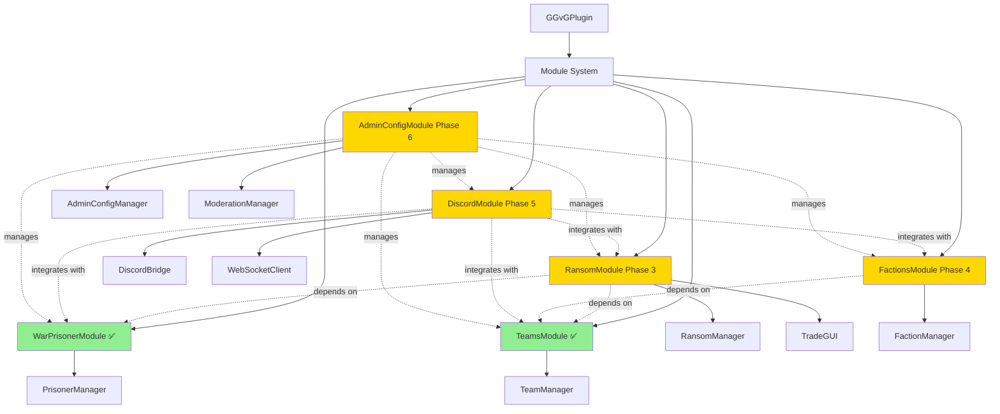
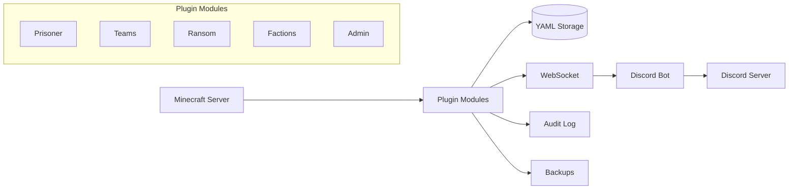

# GG vs Goons Plugin - Phase 3-6 Master Plan

## Executive Summary

This document outlines the comprehensive expansion plan for the GG vs Goons plugin, adding four major feature sets across Phases 3-6. These features build upon the existing foundation (Phases 1-2: Teams and Prisoner systems) to create a rich, integrated gameplay experience.

## Current State (Phases 1-2 Complete)

✅ **Phase 1**: Core prisoner system with persistence, permissions, and offer expiry  
✅ **Phase 2**: Teams system with scoreboard integration, team chat, and spawn points

**Current Architecture:**
```
GGvGPlugin
├── WarPrisonerModule (capture, free, execute prisoners)
├── TeamsModule (GG vs Goons teams)
├── PrisonerManager (state management)
├── TeamManager (team operations)
└── Persistence layer (YAML storage)
```

## Planned Phases Overview

### Phase 3: Ransom/Trading System
**Priority**: High  
**Complexity**: Medium  
**Dependencies**: WarPrisonerModule, TeamsModule

Implement a prisoner ransom system where both captors and prisoners can initiate item trades for release using a chest GUI interface with configurable item restrictions.

**Key Features:**
- Chest GUI with green/red confirmation panes
- Both sides can initiate trades
- Configurable item blacklist/whitelist
- Auto-release prisoner on successful trade
- Persistence for pending trades

**Detailed Plan**: [`phase3-ransom-trading-system-plan.md`](phase3-ransom-trading-system-plan.md)

---

### Phase 4: Factions System
**Priority**: Medium  
**Complexity**: High  
**Dependencies**: TeamsModule

Add a faction system as sub-groups within teams (2-3 factions per team), with the ability to completely disable the feature via configuration.

**Key Features:**
- Factions as sub-groups within GG/Goons teams
- Faction homes and teleportation
- Faction chat channels
- Leadership hierarchy (leader, officers, members)
- Optional alliance system
- Complete enable/disable toggle

**Detailed Plan**: [`phase4-factions-system-plan.md`](phase4-factions-system-plan.md)

---

### Phase 5: Discord Integration
**Priority**: High  
**Complexity**: Very High  
**Dependencies**: All modules

Create a Discord bot from scratch with full integration for war scheduling, prisoner notifications, team chat bridging, and event management.

**Key Features:**
- War scheduling with RSVP system
- Real-time prisoner notifications
- Bidirectional team chat bridge
- Statistics and leaderboards
- Server status monitoring
- Event management system

**Detailed Plan**: [`phase5-discord-integration-plan.md`](phase5-discord-integration-plan.md)

---

### Phase 6: Admin Configuration System
**Priority**: High  
**Complexity**: Medium  
**Dependencies**: All modules

Implement a command-based admin system for real-time configuration changes, module management, and player moderation without requiring server restarts.

**Key Features:**
- Runtime configuration changes
- Module enable/disable
- Command management (disable/enable)
- Permission management
- Player moderation tools
- Audit logging
- Backup/restore system

**Detailed Plan**: [`phase6-admin-config-system-plan.md`](phase6-admin-config-system-plan.md)

---

## Architecture Overview

### Module System Expansion



### Data Flow Diagram



## Integration Matrix

| Feature | Prisoner | Teams | Ransom | Factions | Discord | Admin |
|---------|----------|-------|--------|----------|---------|-------|
| **Prisoner** | - | Required | Required | Optional | Notifies | Managed |
| **Teams** | Required | - | Required | Required | Bridges | Managed |
| **Ransom** | Required | Required | - | Optional | Notifies | Managed |
| **Factions** | Optional | Required | Optional | - | Bridges | Managed |
| **Discord** | Reads | Reads | Reads | Reads | - | Managed |
| **Admin** | Controls | Controls | Controls | Controls | Controls | - |

## Implementation Sequence

### Recommended Order

1. **Phase 3: Ransom System** (2-3 weeks)
   - Builds directly on existing prisoner system
   - Adds immediate gameplay value
   - Relatively self-contained

2. **Phase 6: Admin Config** (2-3 weeks)
   - Enables easier testing of remaining phases
   - Provides tools for managing new features
   - Can be developed in parallel with Phase 4

3. **Phase 4: Factions** (3-4 weeks)
   - More complex, benefits from admin tools
   - Can be disabled if issues arise
   - Adds depth to team gameplay

4. **Phase 5: Discord Integration** (4-5 weeks)
   - Most complex, requires all other systems
   - Benefits from having all features to integrate
   - Can be developed incrementally (5A-5G)

### Alternative: Parallel Development

If multiple developers are available:
- **Developer 1**: Phase 3 → Phase 4
- **Developer 2**: Phase 6 → Phase 5 (bot foundation)
- **Integration**: Phase 5 (full Discord integration)

## Configuration Structure

### Expanded config.yml
```yaml
# GGvGoons Configuration

# Prisoner System Settings (Phase 1-2)
prisoner:
  offer-expiry-timeout: 60
  enable-persistence: true

# Team System Settings (Phase 1-2)
teams:
  allow-team-switching: true
  team-switch-cooldown: 300
  chat:
    enabled: true
    prefix: "[TEAM] "
    format: "{player}: {message}"

# Ransom System Settings (Phase 3)
ransom:
  enabled: true
  restrictions:
    blacklisted-items: [BEDROCK, COMMAND_BLOCK, BARRIER]
    whitelist-enabled: false
    max-items-per-side: 18
  trade-timeout: 300
  auto-release: true
  enable-persistence: true

# Factions System Settings (Phase 4)
factions:
  enabled: true
  max-factions-per-team: 3
  members:
    default-max-members: 10
  homes:
    enabled: true
    teleport-warmup: 5
    teleport-cooldown: 300
  chat:
    enabled: true
  enable-persistence: true

# Discord Integration Settings (Phase 5)
discord:
  enabled: true
  connection:
    websocket:
      enabled: true
      host: "localhost"
      port: 8080
  chat-bridge:
    enabled: true
  notifications:
    prisoners:
      enabled: true
    wars:
      enabled: true

# Admin System Settings (Phase 6)
admin:
  enabled: true
  audit:
    enabled: true
    retention-days: 90
  backups:
    enabled: true
    auto-backup: true
    auto-backup-interval: 3600

# Permission Settings
permissions:
  enabled: true
```

## Command Structure

### Complete Command List

**Prisoner System:**
- `/warprisoner <player>` - Capture player
- `/freeprisoner <player>` - Release prisoner
- `/executeprisoner <player>` - Execute prisoner
- `/listprisoners` - List all prisoners

**Team System:**
- `/team join|leave|info|list|spawn|setspawn|chat`

**Ransom System (Phase 3):**
- `/ransom offer <player>` - Initiate trade
- `/ransom cancel` - Cancel trade
- `/ransom list` - List active trades

**Faction System (Phase 4):**
- `/faction create|disband|info|list|leave`
- `/faction invite|kick|promote|demote`
- `/faction home|sethome`
- `/faction chat <message>` or `/fc <message>`

**Admin System (Phase 6):**
- `/ggadmin module <list|enable|disable|reload>`
- `/ggadmin config <get|set|list|reset>`
- `/ggadmin command <disable|enable|status>`
- `/ggadmin permission <grant|revoke|check>`
- `/ggadmin player <freeze|freeprisoner|resetcooldowns>`
- `/ggadmin audit <view|search|export>`
- `/ggadmin backup <create|restore|list>`

**Discord Commands (Phase 5):**
- `/war schedule|list|cancel` - War management
- `/stats player|team|faction` - Statistics
- `/leaderboard kills|captures|ransoms` - Leaderboards
- `/server status|players` - Server info

## Permission Structure

### Permission Hierarchy
```yaml
ggvgoons.admin.*
├── ggvgoons.admin.config
├── ggvgoons.admin.module
├── ggvgoons.admin.command
├── ggvgoons.admin.permission
├── ggvgoons.admin.moderate
├── ggvgoons.admin.audit
└── ggvgoons.admin.backup

ggvgoons.warprisoner.*
├── ggvgoons.warprisoner.capture
├── ggvgoons.warprisoner.free
├── ggvgoons.warprisoner.execute
└── ggvgoons.warprisoner.list

ggvgoons.team.*
├── ggvgoons.team.use
└── ggvgoons.team.admin

ggvgoons.ransom.*
├── ggvgoons.ransom.use
├── ggvgoons.ransom.bypass-restrictions
└── ggvgoons.ransom.admin

ggvgoons.faction.*
├── ggvgoons.faction.use
├── ggvgoons.faction.create
├── ggvgoons.faction.chat
├── ggvgoons.faction.home
└── ggvgoons.faction.admin
```

## Testing Strategy

### Unit Testing
- Test each module independently
- Mock dependencies
- Test edge cases and error conditions

### Integration Testing
- Test module interactions
- Test data persistence
- Test configuration changes

### User Acceptance Testing
- Test complete workflows
- Test with multiple players
- Test on Arclight server with mods

### Performance Testing
- Load testing with many players
- Memory leak detection
- Database performance
- WebSocket stability

## Risk Assessment

### High Risk Items
1. **Discord Bot Stability** - WebSocket connection reliability
2. **Faction System Complexity** - Many moving parts
3. **GUI Duplication Exploits** - Ransom chest interface
4. **Permission Conflicts** - With LuckPerms or other plugins

### Mitigation Strategies
1. Implement reconnection logic and fallback mechanisms
2. Extensive testing and gradual rollout
3. Strict validation and transaction logging
4. Clear documentation and compatibility testing

## Additional Feature Suggestions

Based on the existing architecture, here are some additional features that could enhance the plugin:

### 1. **Bounty System**
- Players can place bounties on enemies
- Rewards for capturing/killing bounty targets
- Integration with ransom system
- Discord notifications for bounties

### 2. **Territory Control**
- Claimable zones on the map
- Resource generation in controlled territory
- Territory wars and capture mechanics
- Integration with factions

### 3. **Combat Logging**
- Track all PvP encounters
- Combat statistics and analytics
- Prevent combat logging (logout during fight)
- Integration with Discord for kill feeds

### 4. **Economy System**
- Virtual currency for trades
- Faction/team banks
- Salary system for active players
- Integration with ransom system

### 5. **Achievement System**
- Unlock achievements for various actions
- Titles and cosmetic rewards
- Leaderboards for achievements
- Discord integration for announcements

### 6. **War Zones**
- Designated PvP areas
- Special rules in war zones
- Scheduled events in zones
- Rewards for zone control

### 7. **Prisoner Minigames**
- Escape challenges for prisoners
- Rescue missions for teammates
- Negotiation mechanics
- Time-based release conditions

### 8. **Advanced Statistics**
- Heatmaps of player activity
- Combat analytics
- Team performance metrics
- Predictive analytics for wars

### 9. **Mobile App Integration**
- View server status on mobile
- Receive notifications
- Chat with team
- Manage faction remotely

### 10. **Replay System**
- Record important battles
- Replay viewer in-game
- Share replays on Discord
- Highlight reels

## Timeline Estimates

### Conservative Estimates (Single Developer)
- **Phase 3 (Ransom)**: 2-3 weeks
- **Phase 4 (Factions)**: 3-4 weeks
- **Phase 5 (Discord)**: 4-5 weeks
- **Phase 6 (Admin)**: 2-3 weeks
- **Testing & Polish**: 2-3 weeks
- **Total**: 13-18 weeks (3-4.5 months)

### Aggressive Estimates (Multiple Developers)
- **Phase 3 + 6 (Parallel)**: 3-4 weeks
- **Phase 4**: 3-4 weeks
- **Phase 5**: 4-5 weeks
- **Integration & Testing**: 2-3 weeks
- **Total**: 12-16 weeks (3-4 months)

## Success Criteria

### Phase 3 Success
- [ ] Trades complete successfully
- [ ] Items transfer correctly
- [ ] Prisoners auto-release
- [ ] No item duplication exploits
- [ ] GUI is intuitive and responsive

### Phase 4 Success
- [ ] Factions can be created/disbanded
- [ ] Member management works correctly
- [ ] Faction homes function properly
- [ ] Can be disabled without issues
- [ ] No conflicts with team system

### Phase 5 Success
- [ ] Discord bot stays connected
- [ ] Chat bridge works bidirectionally
- [ ] War scheduling functions correctly
- [ ] Notifications are timely and accurate
- [ ] Statistics are accurate

### Phase 6 Success
- [ ] Config changes apply immediately
- [ ] Modules can be toggled safely
- [ ] Audit log is comprehensive
- [ ] Backups restore correctly
- [ ] No permission escalation exploits

## Maintenance Plan

### Regular Maintenance
- Weekly backup verification
- Monthly audit log review
- Quarterly performance optimization
- Regular dependency updates

### Monitoring
- Server performance metrics
- Error rate tracking
- Player feedback collection
- Discord bot uptime monitoring

### Documentation
- Keep README updated
- Document all configuration options
- Maintain API documentation
- Create video tutorials

## Conclusion

This comprehensive plan outlines the expansion of the GG vs Goons plugin from its current state (Phases 1-2) through four major feature additions (Phases 3-6). Each phase builds upon the previous work while maintaining the modular architecture that makes the plugin maintainable and extensible.

The recommended implementation order prioritizes features that add immediate value (Ransom system) and tools that facilitate development (Admin system), before tackling the more complex features (Factions and Discord integration).

With careful implementation and thorough testing, these additions will transform the plugin into a comprehensive server management and gameplay enhancement system.

## Next Steps

1. **Review this plan** - Ensure all requirements are captured
2. **Prioritize phases** - Confirm implementation order
3. **Set up development environment** - Prepare for implementation
4. **Begin Phase 3** - Start with ransom system
5. **Iterate and improve** - Gather feedback and adjust

---

**Document Version**: 1.0  
**Last Updated**: 2026-09-02  
**Status**: Awaiting Approval
