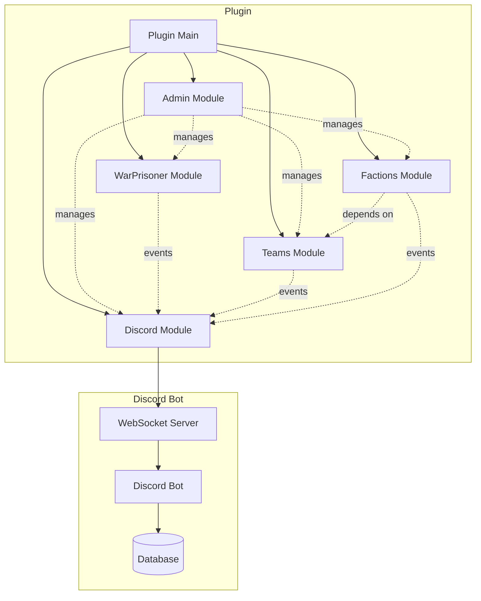

# Phase 4, 5, 6 Implementation Plan - Part 2
## Testing, Timeline, and Deployment Strategy

This document continues from [`phase4-5-6-implementation-plan.md`](phase4-5-6-implementation-plan.md)

---

## Integration Strategy Continued

### Module Communication Flow


### Integration Points Continued

#### Phase 6 (Admin) with TeamsModule
- Kick players from teams
- Modify team configuration
- View team statistics
- Reset team cooldowns

#### Phase 5 (Discord) Integration
- **With All Modules**:
  - Receive events from all modules
  - Send commands to all modules
  - Display statistics from all modules
  
- **With WarPrisonerModule**:
  - Prisoner capture notifications
  - Prisoner release notifications
  - Execute notifications
  
- **With TeamsModule**:
  - Team chat bridge
  - Team statistics
  - Team member lists
  
- **With FactionsModule** (Phase 4):
  - Faction chat bridge (optional)
  - Faction statistics
  - Faction leaderboards
  
- **With AdminModule** (Phase 6):
  - Remote admin commands
  - Configuration changes from Discord
  - Audit log viewing

---

## Testing Strategy

### Unit Testing Approach
```kotlin
// Example test structure
class FactionManagerTest {
    @Test
    fun `createFaction should validate team membership`() {
        // Test implementation
    }
    
    @Test
    fun `createFaction should enforce faction limit per team`() {
        // Test implementation
    }
    
    @Test
    fun `invitePlayer should create valid invite with expiry`() {
        // Test implementation
    }
}
```

### Integration Testing Scenarios

#### Phase 4 & 6 Integration Tests
1. **Faction Creation Flow**:
   - Player joins team
   - Player creates faction
   - Admin views faction via `/ggadmin stats faction`
   - Admin modifies faction config
   - Verify changes apply immediately

2. **Module Management Flow**:
   - Admin disables faction module
   - Verify faction commands return disabled message
   - Admin re-enables faction module
   - Verify factions restore correctly

3. **Moderation Flow**:
   - Player creates faction
   - Admin kicks player from faction
   - Verify faction updates correctly
   - Check audit log for action

#### Phase 5 Integration Tests
1. **Chat Bridge Flow**:
   - Player sends team chat in Minecraft
   - Verify message appears in Discord
   - User sends message in Discord team channel
   - Verify message appears in Minecraft

2. **War Scheduling Flow**:
   - Admin schedules war in Discord
   - Verify in-game announcement
   - Verify reminders at correct intervals
   - Verify war start notification

3. **Notification Flow**:
   - Player captures prisoner
   - Verify Discord notification
   - Verify notification format and content
   - Verify interactive buttons work

### Performance Testing

#### Load Testing Scenarios
- 50+ players online simultaneously
- Multiple faction operations concurrent
- High-frequency chat messages
- Multiple Discord notifications per second
- Database query performance under load

#### Memory Testing
- Monitor memory usage over 24 hours
- Check for memory leaks in WebSocket connections
- Verify proper cleanup of expired invites
- Monitor faction data cache size

### User Acceptance Testing

#### Test Scenarios
1. **New Player Experience**:
   - Join server
   - Join team
   - Receive faction invite
   - Accept invite
   - Use faction features

2. **Admin Experience**:
   - Use admin commands
   - Modify configuration
   - Moderate players
   - View audit logs
   - Create backups

3. **Discord User Experience**:
   - View server status
   - Participate in team chat
   - RSVP to war event
   - View leaderboards
   - Check player statistics

---

## Timeline & Milestones

### Phase 4 & 6 (Parallel Development)

#### Week 1-2: Foundation
**Phase 4 Tasks**:
- [ ] Create faction data models
- [ ] Implement FactionManager core CRUD
- [ ] Set up FactionPersistence
- [ ] Create FactionsModule registration
- [ ] Add faction configuration to config.yml

**Phase 6 Tasks**:
- [ ] Create admin data models
- [ ] Implement AdminConfigManager
- [ ] Create ConfigValidator
- [ ] Set up AuditLogger
- [ ] Add admin configuration to config.yml

**Milestone 1**: Core infrastructure complete for both phases

#### Week 3-4: Core Features
**Phase 4 Tasks**:
- [ ] Implement member management (invite/kick/promote)
- [ ] Create faction home system
- [ ] Implement faction chat
- [ ] Add event listeners
- [ ] Create FactionCommand with all subcommands

**Phase 6 Tasks**:
- [ ] Implement module management
- [ ] Create command restriction system
- [ ] Implement PermissionManager
- [ ] Create ModerationManager
- [ ] Implement BackupManager

**Milestone 2**: Core features functional for both phases

#### Week 5: Integration & Testing
- [ ] Integrate Phase 4 with TeamsModule
- [ ] Integrate Phase 6 with all modules
- [ ] Cross-module integration testing
- [ ] Update plugin.yml with new commands
- [ ] Register modules in GGvGPlugin
- [ ] Performance testing
- [ ] Bug fixes

**Milestone 3**: Phase 4 & 6 complete and integrated

### Phase 5 (Discord Integration)

#### Week 6-7: Bot Foundation
- [ ] Set up Discord bot project
- [ ] Implement JDA integration
- [ ] Create WebSocket server in bot
- [ ] Set up database (SQLite)
- [ ] Create basic slash commands
- [ ] Implement bot configuration
- [ ] Deploy and test bot

**Milestone 4**: Discord bot operational

#### Week 8: Plugin Bridge
- [ ] Create DiscordModule in plugin
- [ ] Implement WebSocketClient
- [ ] Create DiscordBridge
- [ ] Add Discord configuration to plugin
- [ ] Test connection between plugin and bot
- [ ] Implement reconnection logic

**Milestone 5**: Plugin-Bot communication established

#### Week 9: Chat & Notifications
- [ ] Implement team chat bridge (bidirectional)
- [ ] Create prisoner notification system
- [ ] Implement rich embeds
- [ ] Add interactive buttons
- [ ] Test message formatting
- [ ] Implement rate limiting

**Milestone 6**: Chat and notifications working

#### Week 10: War Scheduling & Statistics
- [ ] Implement war scheduling commands
- [ ] Create event storage in database
- [ ] Implement reminder system
- [ ] Create statistics tracking
- [ ] Implement leaderboard commands
- [ ] Add server monitoring

**Milestone 7**: All Discord features complete

#### Week 11: Final Integration & Testing
- [ ] Integration testing with all modules
- [ ] Performance testing
- [ ] Security testing
- [ ] User acceptance testing
- [ ] Documentation updates
- [ ] Bug fixes and polish

**Milestone 8**: Phase 5 complete

### Total Timeline
- **Phases 4 & 6**: 5 weeks
- **Phase 5**: 6 weeks
- **Total**: 11 weeks (approximately 2.5-3 months)

---

## Risk Assessment & Mitigation

### High-Risk Items

#### 1. WebSocket Connection Stability (Phase 5)
**Risk**: Connection drops, message loss, reconnection failures  
**Impact**: High - breaks Discord integration  
**Mitigation**:
- Implement robust reconnection logic with exponential backoff
- Add message queuing for offline periods
- Implement heartbeat/ping mechanism
- Add fallback to database polling if WebSocket fails
- Comprehensive error logging

#### 2. Faction System Complexity (Phase 4)
**Risk**: Complex interactions with teams, edge cases, data corruption  
**Impact**: Medium - affects gameplay but isolated  
**Mitigation**:
- Extensive unit testing for all operations
- Transaction-based operations for data consistency
- Comprehensive validation before state changes
- Ability to disable system if issues arise
- Regular data backups

#### 3. Configuration Hot-Reload (Phase 6)
**Risk**: Config changes cause crashes, data loss, inconsistent state  
**Impact**: High - affects entire plugin  
**Mitigation**:
- Validate all config changes before applying
- Automatic backup before config changes
- Rollback capability on failure
- Graceful degradation if module fails to reload
- Extensive testing of all config paths

#### 4. Permission System Conflicts (Phase 6)
**Risk**: Conflicts with LuckPerms or other permission plugins  
**Impact**: Medium - affects access control  
**Mitigation**:
- Detect and integrate with LuckPerms properly
- Fallback to internal system if conflicts
- Clear documentation of permission structure
- Testing with and without LuckPerms

#### 5. Discord Bot Token Security (Phase 5)
**Risk**: Token exposure, unauthorized access  
**Impact**: Critical - compromises Discord server  
**Mitigation**:
- Store token in environment variable or encrypted config
- Never commit token to version control
- Implement authentication for WebSocket
- Rate limiting on all Discord commands
- Audit logging of all Discord actions

### Medium-Risk Items

#### 6. Database Performance (Phase 5)
**Risk**: Slow queries, database locks, data corruption  
**Impact**: Medium - affects statistics and war scheduling  
**Mitigation**:
- Use connection pooling (HikariCP)
- Index frequently queried columns
- Async database operations
- Regular database maintenance
- Backup strategy

#### 7. Memory Leaks (All Phases)
**Risk**: Unclosed resources, cached data growth  
**Impact**: Medium - degrades performance over time  
**Mitigation**:
- Proper resource cleanup in onDisable
- Regular cleanup of expired data (invites, cooldowns)
- Memory profiling during testing
- Configurable cache limits

---

## Documentation Requirements

### Code Documentation
- [ ] KDoc comments for all public APIs
- [ ] Inline comments for complex logic
- [ ] Architecture decision records (ADRs)
- [ ] Module interaction diagrams

### User Documentation
- [ ] Update README.md with new features
- [ ] Command reference guide
- [ ] Configuration guide
- [ ] Permission reference
- [ ] Troubleshooting guide

### Admin Documentation
- [ ] Admin command guide
- [ ] Configuration best practices
- [ ] Backup and restore procedures
- [ ] Monitoring and maintenance guide
- [ ] Security recommendations

### Developer Documentation
- [ ] Module development guide
- [ ] API documentation
- [ ] Testing guide
- [ ] Contribution guidelines
- [ ] Discord bot setup guide

---

## Security Considerations

### Authentication & Authorization
- [ ] Validate permissions for all commands
- [ ] Implement rate limiting on expensive operations
- [ ] Secure WebSocket authentication
- [ ] Protect Discord bot token
- [ ] Audit logging of sensitive operations

### Input Validation
- [ ] Sanitize all user input
- [ ] Validate configuration values
- [ ] Prevent SQL injection (use prepared statements)
- [ ] Prevent command injection
- [ ] Validate Discord message content

### Data Protection
- [ ] Encrypt sensitive configuration values
- [ ] Secure backup files
- [ ] Protect audit logs from tampering
- [ ] Secure database access
- [ ] Implement data retention policies

### Access Control
- [ ] Principle of least privilege
- [ ] Separate admin and moderator permissions
- [ ] Faction leader/officer hierarchy
- [ ] Discord role-based access
- [ ] Command-level permissions

---

## Performance Optimization

### Caching Strategy
- Cache faction data in memory
- Cache team membership lookups
- Cache permission checks
- Cache configuration values
- Implement cache invalidation on updates

### Async Operations
- Async database queries
- Async file I/O (backups, logs)
- Async Discord API calls
- Async WebSocket messages
- Non-blocking command execution

### Resource Management
- Connection pooling for database
- Reuse WebSocket connections
- Cleanup expired data regularly
- Limit cache sizes
- Monitor memory usage

### Database Optimization
- Index frequently queried columns
- Use batch operations where possible
- Optimize query patterns
- Regular database maintenance
- Consider migration to MySQL for large servers

---

## Deployment Strategy

### Development Environment
1. Set up local test server (Paper 1.21.1)
2. Configure development Discord server
3. Set up local database
4. Enable debug logging
5. Use hot-reload for rapid testing

### Staging Environment
1. Deploy to staging server
2. Test with multiple players
3. Performance testing under load
4. Integration testing with mods (Arclight)
5. User acceptance testing

### Production Deployment
1. Create backup of current plugin
2. Deploy new version during low-traffic period
3. Monitor logs for errors
4. Verify all modules load correctly
5. Test critical functionality
6. Announce new features to players

### Rollback Plan
1. Keep previous version available
2. Document rollback procedure
3. Test rollback in staging
4. Backup data before deployment
5. Quick rollback if critical issues

---

## Success Criteria

### Phase 4 Success Criteria
- [ ] Players can create factions within teams
- [ ] Faction limit per team enforced (max 3)
- [ ] Invite system works with expiry
- [ ] Member management (kick/promote/demote) functional
- [ ] Faction homes work with warmup/cooldown
- [ ] Faction chat isolated and functional
- [ ] Persistence works across restarts
- [ ] Can disable faction system without issues
- [ ] No conflicts with team system
- [ ] Performance acceptable with 50+ players

### Phase 6 Success Criteria
- [ ] Configuration changes apply immediately
- [ ] All config paths validated correctly
- [ ] Modules can be enabled/disabled safely
- [ ] Command restrictions work globally and per-player
- [ ] Permission system integrates with LuckPerms
- [ ] Player moderation tools functional
- [ ] Audit log comprehensive and searchable
- [ ] Backups create and restore correctly
- [ ] No permission escalation exploits
- [ ] Performance acceptable with frequent admin actions

### Phase 5 Success Criteria
- [ ] Discord bot stays connected reliably
- [ ] WebSocket reconnects automatically
- [ ] Chat bridge works bidirectionally
- [ ] Messages formatted correctly both ways
- [ ] War scheduling functional with reminders
- [ ] All prisoner notifications work
- [ ] Statistics accurate and up-to-date
- [ ] Leaderboards display correctly
- [ ] Server monitoring accurate
- [ ] No message loss during normal operation
- [ ] Performance acceptable with high message volume

---

## Next Steps

### Immediate Actions
1. **Review this plan** with stakeholders
2. **Set up development environment**:
   - Local Paper server
   - Development Discord server
   - IDE configuration
3. **Create project branches**:
   - `feature/phase4-factions`
   - `feature/phase6-admin`
   - `feature/phase5-discord` (later)
4. **Begin Phase 4 & 6 implementation** in parallel

### Week 1 Goals
- Complete data models for Phase 4 and 6
- Set up module structure
- Implement basic CRUD operations
- Add configuration sections
- Create initial command structure

### Communication Plan
- Weekly progress updates
- Demo sessions at each milestone
- Issue tracking for bugs and features
- Documentation updates as features complete

---

## Appendix

### Useful Resources
- [Paper API Documentation](https://jd.papermc.io/paper/1.21/)
- [JDA Documentation](https://docs.jda.wiki/)
- [Kotlin Coroutines Guide](https://kotlinlang.org/docs/coroutines-guide.html)
- [WebSocket Protocol](https://datatracker.ietf.org/doc/html/rfc6455)
- [LuckPerms API](https://luckperms.net/wiki/Developer-API)

### Command Quick Reference

#### Phase 4 Commands
```
/faction create <name>
/faction disband
/faction info [faction]
/faction list
/faction invite <player>
/faction kick <player>
/faction accept <faction>
/faction decline <faction>
/faction promote <player>
/faction demote <player>
/faction transfer <player>
/faction leave
/faction home
/faction sethome
/faction chat <message>
/fc <message>
```

#### Phase 6 Commands
```
/ggadmin module list|enable|disable|reload|info <module>
/ggadmin config get|set|list|reset|reload|save <path> [value]
/ggadmin command list|disable|enable|status|cooldown <command> [player]
/ggadmin permission list|grant|revoke|check|group <player> <permission>
/ggadmin player freeze|unfreeze|freeprisoner|resetcooldowns|kickteam|kickfaction|info <player>
/ggadmin stats server|module|player|team [name]
/ggadmin monitor start|stop
/ggadmin audit view|search|filter|export [query]
/ggadmin backup create|list|restore|delete|auto [name]
```

#### Phase 5 Discord Commands
```
/war schedule <date> <time> <team1> <team2>
/war list
/war cancel <id>
/stats player <name>
/stats team <team>
/stats faction <faction>
/leaderboard kills|captures|ransoms
/server status
/server players
```

---

**Document Version**: 1.0  
**Last Updated**: 2026-09-02  
**Status**: Ready for Implementation  
**Estimated Completion**: 11 weeks from start date
