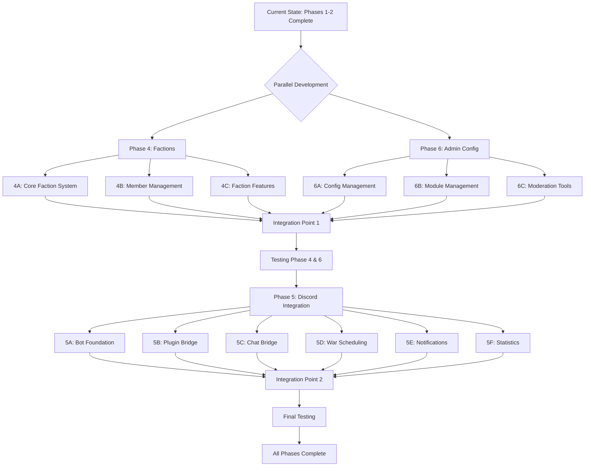
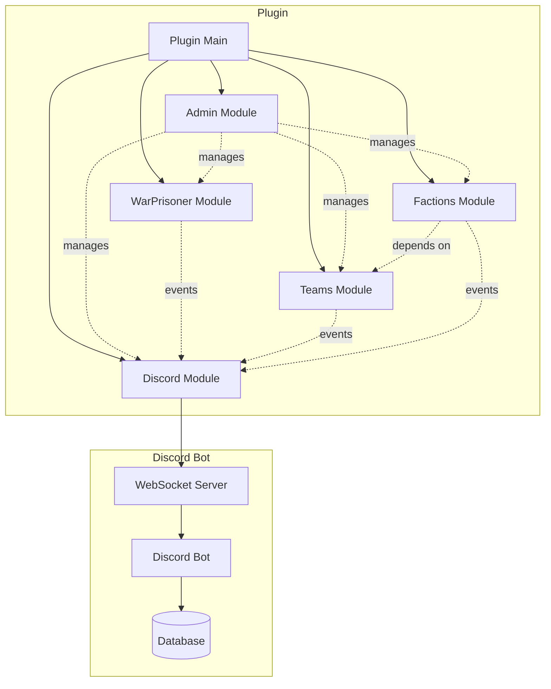

# Phase 4, 5, 6 Implementation Plan
## GG vs Goons Plugin - Comprehensive Expansion

**Created**: 2026-09-02  
**Implementation Strategy**: Phase 4 & 6 in parallel, then Phase 5  
**Current Status**: Planning

---

## Table of Contents
1. [Overview](#overview)
2. [Phase 4: Factions System](#phase-4-factions-system)
3. [Phase 6: Admin Configuration System](#phase-6-admin-configuration-system)
4. [Phase 5: Discord Integration](#phase-5-discord-integration)
5. [Dependencies & Build Configuration](#dependencies--build-configuration)
6. [Integration Strategy](#integration-strategy)
7. [Testing Strategy](#testing-strategy)
8. [Timeline & Milestones](#timeline--milestones)

---

## Overview

### Implementation Order


### Current Architecture
```
GGvGPlugin (Main)
├── WarPrisonerModule ✅
│   ├── PrisonerManager
│   └── PrisonerPersistence
├── TeamsModule ✅
│   ├── TeamManager
│   ├── TeamCommand
│   └── TeamPersistence
└── Module System (GGvGModule interface)
```

### Target Architecture
```
GGvGPlugin (Main)
├── WarPrisonerModule ✅
├── TeamsModule ✅
├── FactionsModule 🔨 (Phase 4)
│   ├── FactionManager
│   ├── FactionCommand
│   ├── Faction (data class)
│   └── FactionPersistence
├── AdminConfigModule 🔨 (Phase 6)
│   ├── AdminConfigManager
│   ├── AdminCommand
│   ├── ModerationManager
│   ├── PermissionManager
│   └── AuditLogger
└── DiscordModule 🔜 (Phase 5)
    ├── DiscordBridge
    ├── WebSocketClient
    └── DiscordConfig
```

---

## Phase 4: Factions System

### 4.1 Architecture Design

#### Module Structure
```
src/main/kotlin/com/tyler/ggvsgoons/factions/
├── FactionsModule.kt          # Module registration & initialization
├── FactionManager.kt          # Core faction management logic
├── FactionCommand.kt          # Command executor
├── Faction.kt                 # Data classes
├── FactionInvite.kt          # Invite system
├── FactionStats.kt           # Statistics tracking
└── FactionEventListener.kt   # Event handling

src/main/kotlin/com/tyler/ggvsgoons/persistence/
└── FactionPersistence.kt     # Save/load faction data
```

#### Data Models
```kotlin
// Faction.kt
data class Faction(
    val id: String,
    val name: String,
    val teamId: String,              // "gg" or "goons"
    val leaderId: UUID,
    val members: MutableSet<UUID>,
    val officers: MutableSet<UUID>,
    val description: String = "",
    val color: ChatColor = ChatColor.WHITE,
    val homeLocation: Location? = null,
    val createdAt: Long = System.currentTimeMillis(),
    val maxMembers: Int = 10
)

data class FactionInvite(
    val factionId: String,
    val inviterId: UUID,
    val inviteeId: UUID,
    val expiresAt: Long
)

data class FactionStats(
    val factionId: String,
    val totalKills: Int = 0,
    val totalDeaths: Int = 0,
    val prisonersCaptured: Int = 0
)
```

### 4.2 Implementation Steps

#### Step 4A: Core Faction System
1. Create `Faction.kt` data class with all properties
2. Create `FactionsModule.kt` implementing `GGvGModule`
3. Create `FactionManager.kt` with basic CRUD operations:
   - `createFaction(name: String, leaderId: UUID, teamId: String): Faction?`
   - `disbandFaction(factionId: String): Boolean`
   - `getFaction(factionId: String): Faction?`
   - `getFactionByPlayer(playerId: UUID): Faction?`
   - `listFactionsByTeam(teamId: String): List<Faction>`
4. Add faction validation logic:
   - Check team membership
   - Enforce faction limits per team
   - Validate unique faction names within team
5. Create `FactionPersistence.kt` for YAML storage

#### Step 4B: Member Management
1. Implement invite system in `FactionManager`:
   - `invitePlayer(factionId: String, inviterId: UUID, inviteeId: UUID)`
   - `acceptInvite(playerId: UUID, factionId: String)`
   - `declineInvite(playerId: UUID, factionId: String)`
   - Invite expiry tracking (60 seconds default)
2. Implement member operations:
   - `kickMember(factionId: String, kickerId: UUID, targetId: UUID)`
   - `promoteMember(factionId: String, leaderId: UUID, targetId: UUID)`
   - `demoteMember(factionId: String, leaderId: UUID, targetId: UUID)`
   - `transferLeadership(factionId: String, leaderId: UUID, newLeaderId: UUID)`
   - `leaveFaction(playerId: UUID)`
3. Add permission hierarchy validation:
   - Leader: full control
   - Officer: invite/kick only
   - Member: basic access

#### Step 4C: Faction Features
1. Implement faction home system:
   - `setFactionHome(factionId: String, location: Location)`
   - `teleportToHome(playerId: UUID)` with warmup/cooldown
   - Cancel teleport on damage
2. Implement faction chat:
   - `/faction chat <message>` or `/fc <message>`
   - Faction-only message broadcasting
   - Chat formatting with faction colors
3. Create `FactionCommand.kt` with subcommands:
   - `/faction create <name>`
   - `/faction disband`
   - `/faction info [faction]`
   - `/faction list`
   - `/faction invite <player>`
   - `/faction kick <player>`
   - `/faction accept <faction>`
   - `/faction decline <faction>`
   - `/faction promote <player>`
   - `/faction demote <player>`
   - `/faction transfer <player>`
   - `/faction leave`
   - `/faction home`
   - `/faction sethome`
   - `/faction chat <message>`
4. Add event listeners:
   - `PlayerJoinEvent` - restore faction data
   - `PlayerQuitEvent` - save faction data
   - `AsyncPlayerChatEvent` - handle faction chat
   - `EntityDamageByEntityEvent` - cancel teleport warmup
   - Team change events - remove from faction

#### Step 4D: Configuration & Integration
1. Add faction configuration to `config.yml`:
```yaml
factions:
  enabled: true
  max-factions-per-team: 3
  creation:
    min-team-members: 3
  members:
    default-max-members: 10
  homes:
    enabled: true
    teleport-warmup: 5
    teleport-cooldown: 300
    cancel-on-damage: true
  chat:
    enabled: true
    prefix: "[FACTION] "
    format: "{faction} {player}: {message}"
  enable-persistence: true
```

2. Update `plugin.yml` with faction commands and permissions
3. Register `FactionsModule` in `GGvGPlugin.onEnable()`
4. Add integration hooks with `TeamsModule`:
   - Listen for team leave events
   - Validate team membership for faction operations
5. Implement enable/disable mechanism

### 4.3 Testing Checklist
- [ ] Create faction with valid team membership
- [ ] Enforce faction limit per team (max 3)
- [ ] Invite system with expiry
- [ ] Accept/decline invites
- [ ] Kick members (officer/leader only)
- [ ] Promote/demote members (leader only)
- [ ] Transfer leadership
- [ ] Leave faction
- [ ] Set faction home
- [ ] Teleport to home with warmup/cooldown
- [ ] Cancel teleport on damage
- [ ] Faction chat functionality
- [ ] Disband faction
- [ ] Persistence across restarts
- [ ] Disable faction system (config)
- [ ] Integration with team system

---

## Phase 6: Admin Configuration System

### 6.1 Architecture Design

#### Module Structure
```
src/main/kotlin/com/tyler/ggvsgoons/admin/
├── AdminConfigModule.kt       # Module registration
├── AdminConfigManager.kt      # Configuration management
├── AdminCommand.kt            # Main admin command
├── ConfigValidator.kt         # Validate config changes
├── ModerationManager.kt       # Player moderation
├── PermissionManager.kt       # Runtime permissions
├── AuditLogger.kt            # Action logging
└── BackupManager.kt          # Backup/restore system
```

#### Data Models
```kotlin
// AdminCommand.kt
data class ConfigChange(
    val adminId: UUID,
    val adminName: String,
    val path: String,
    val oldValue: Any?,
    val newValue: Any?,
    val timestamp: Long = System.currentTimeMillis(),
    val reason: String? = null
)

data class ModerationAction(
    val actionId: UUID,
    val adminId: UUID,
    val targetId: UUID,
    val actionType: ModActionType,
    val reason: String,
    val duration: Long? = null,
    val timestamp: Long = System.currentTimeMillis()
)

enum class ModActionType {
    DISABLE_COMMAND,
    ENABLE_COMMAND,
    FREEZE_PLAYER,
    UNFREEZE_PLAYER,
    FORCE_FREE_PRISONER,
    CANCEL_TRADE,
    KICK_FROM_TEAM,
    KICK_FROM_FACTION,
    RESET_COOLDOWN,
    GRANT_PERMISSION,
    REVOKE_PERMISSION
}

data class CommandRestriction(
    val command: String,
    val disabled: Boolean,
    val disabledFor: Set<UUID> = emptySet(),
    val reason: String? = null
)
```

### 6.2 Implementation Steps

#### Step 6A: Configuration Management
1. Create `AdminConfigModule.kt` implementing `GGvGModule`
2. Create `AdminConfigManager.kt` with runtime config operations:
   - `getConfigValue(path: String): Any?`
   - `setConfigValue(path: String, value: Any): Boolean`
   - `resetConfigValue(path: String): Boolean`
   - `listConfigOptions(section: String?): Map<String, Any>`
   - `reloadConfig(): Boolean`
   - `saveConfig(): Boolean`
3. Create `ConfigValidator.kt` for input validation:
   - Type checking (int, boolean, string, etc.)
   - Range validation (e.g., cooldowns >= 0)
   - Dependency validation (e.g., ransom requires prisoner module)
4. Implement immediate config application:
   - Notify modules of config changes
   - Update cached values
   - No restart required

#### Step 6B: Module Management
1. Add module management to `AdminConfigManager`:
   - `listModules(): Map<String, Boolean>` (name -> enabled)
   - `enableModule(moduleName: String): Boolean`
   - `disableModule(moduleName: String): Boolean`
   - `reloadModule(moduleName: String): Boolean`
   - `getModuleInfo(moduleName: String): ModuleInfo`
2. Implement graceful module shutdown:
   - Save module state
   - Cancel scheduled tasks
   - Preserve data
3. Implement hot-reload capability:
   - Reload module without full restart
   - Restore previous state

#### Step 6C: Command Management
1. Create command restriction system:
   - `disableCommand(command: String, playerId: UUID?): Boolean`
   - `enableCommand(command: String, playerId: UUID?): Boolean`
   - `getCommandStatus(command: String): CommandRestriction`
   - `resetCommandCooldown(command: String, playerId: UUID): Boolean`
2. Implement command interception:
   - Check restrictions before execution
   - Custom disable messages
   - Admin bypass option

#### Step 6D: Permission Management
1. Create `PermissionManager.kt`:
   - `grantPermission(playerId: UUID, permission: String): Boolean`
   - `revokePermission(playerId: UUID, permission: String): Boolean`
   - `checkPermission(playerId: UUID, permission: String): Boolean`
   - `listPermissions(playerId: UUID): Set<String>`
   - `assignGroup(playerId: UUID, group: String): Boolean`
2. Implement LuckPerms integration:
   - Detect LuckPerms presence
   - Use LuckPerms API if available
   - Fallback to internal system
3. Add temporary permissions with expiry

#### Step 6E: Player Moderation
1. Create `ModerationManager.kt`:
   - `freezePlayer(playerId: UUID, reason: String): Boolean`
   - `unfreezePlayer(playerId: UUID): Boolean`
   - `forceFreeePrisoner(playerId: UUID, adminId: UUID): Boolean`
   - `resetCooldowns(playerId: UUID): Boolean`
   - `kickFromTeam(playerId: UUID, adminId: UUID): Boolean`
   - `kickFromFaction(playerId: UUID, adminId: UUID): Boolean`
   - `getPlayerInfo(playerId: UUID): PlayerInfo`
2. Implement freeze mechanism:
   - Prevent movement
   - Prevent interaction
   - Visual indicator
3. Add reason tracking for all actions

#### Step 6F: Audit Logging
1. Create `AuditLogger.kt`:
   - `logConfigChange(change: ConfigChange)`
   - `logModAction(action: ModerationAction)`
   - `logPlayerAction(action: String, playerId: UUID, details: String)`
   - `viewAuditLog(page: Int): List<AuditEntry>`
   - `searchAuditLog(query: String): List<AuditEntry>`
   - `exportAuditLog(format: String): File`
2. Implement persistent log storage:
   - File-based logging
   - Automatic rotation
   - Configurable retention
3. Add searchable/filterable interface

#### Step 6G: Backup & Restore
1. Create `BackupManager.kt`:
   - `createBackup(name: String?): File`
   - `listBackups(): List<BackupInfo>`
   - `restoreBackup(name: String): Boolean`
   - `deleteBackup(name: String): Boolean`
   - `enableAutoBackup(interval: Int): Boolean`
2. Implement automatic backups:
   - Before major config changes
   - Scheduled intervals
   - Retention policy
3. Add backup verification

#### Step 6H: Admin Commands
1. Create `AdminCommand.kt` with subcommands:
   - `/ggadmin module list|enable|disable|reload|info`
   - `/ggadmin config get|set|list|reset|reload|save`
   - `/ggadmin command list|disable|enable|status|cooldown`
   - `/ggadmin permission list|grant|revoke|check|group`
   - `/ggadmin player freeze|unfreeze|freeprisoner|resetcooldowns|kickteam|kickfaction|info`
   - `/ggadmin stats server|module|player|team`
   - `/ggadmin monitor start|stop`
   - `/ggadmin audit view|search|filter|export`
   - `/ggadmin backup create|list|restore|delete|auto`
2. Add comprehensive tab completion
3. Implement help system

#### Step 6I: Configuration & Integration
1. Add admin configuration to `config.yml`:
```yaml
admin:
  enabled: true
  audit:
    enabled: true
    log-file: "audit.log"
    retention-days: 90
    log-player-actions: true
    log-config-changes: true
    log-mod-actions: true
  backups:
    enabled: true
    auto-backup: true
    auto-backup-interval: 3600
    max-backups: 10
    backup-directory: "backups"
  commands:
    allow-admin-bypass: true
    custom-disable-message: "&cThis command is currently disabled."
  permissions:
    use-luckperms: true
    fallback-to-internal: true
  monitoring:
    enabled: true
    performance-warnings: true
    error-notifications: true
    notify-admins: true
```

2. Update `plugin.yml` with admin commands and permissions
3. Register `AdminConfigModule` in `GGvGPlugin.onEnable()`
4. Add integration hooks with all modules

### 6.3 Testing Checklist
- [ ] Get/set configuration values
- [ ] Configuration validation (type, range)
- [ ] Enable/disable modules
- [ ] Reload modules
- [ ] Disable commands globally
- [ ] Disable commands per-player
- [ ] Reset command cooldowns
- [ ] Grant/revoke permissions
- [ ] LuckPerms integration
- [ ] Freeze/unfreeze players
- [ ] Force free prisoners
- [ ] Kick from team/faction
- [ ] Audit log viewing
- [ ] Audit log searching
- [ ] Create backups
- [ ] Restore backups
- [ ] Auto-backup functionality
- [ ] Tab completion
- [ ] Permission enforcement
- [ ] Help system

---

## Phase 5: Discord Integration

### 5.1 Architecture Design

#### Project Structure
```
discord-bot/                           # Separate Discord bot project
├── src/main/kotlin/com/tyler/ggvsgoons/discord/
│   ├── GGvGoonsBot.kt                # Main bot class
│   ├── commands/                      # Discord slash commands
│   │   ├── WarCommands.kt
│   │   ├── PrisonerCommands.kt
│   │   ├── TeamCommands.kt
│   │   └── StatsCommands.kt
│   ├── listeners/                     # Event listeners
│   │   ├── MessageListener.kt
│   │   ├── ButtonListener.kt
│   │   └── ModalListener.kt
│   ├── bridge/                        # MC <-> Discord bridge
│   │   ├── ChatBridge.kt
│   │   ├── EventBridge.kt
│   │   └── WebSocketServer.kt
│   ├── scheduling/                    # War scheduling
│   │   ├── WarScheduler.kt
│   │   └── EventManager.kt
│   └── database/                      # Shared data access
│       └── DatabaseManager.kt
└── build.gradle.kts

src/main/kotlin/com/tyler/ggvsgoons/discord/  # Plugin integration
├── DiscordModule.kt                   # Module registration
├── DiscordBridge.kt                   # Communication with bot
├── WebSocketClient.kt                 # Real-time communication
└── DiscordConfig.kt                   # Configuration
```

#### Communication Architecture
```
Discord Bot (WebSocket Server) <---> Plugin (WebSocket Client)
         ↓                                    ↓
    Discord API                         Bukkit Server
         ↓                                    ↓
   Discord Server                      Minecraft Server
```

### 5.2 Implementation Steps

#### Step 5A: Discord Bot Foundation
1. Create separate Discord bot project
2. Set up JDA (Java Discord API) dependency
3. Create `GGvGoonsBot.kt` main class:
   - Bot initialization
   - Event registration
   - Command registration
4. Implement basic slash commands framework
5. Set up WebSocket server in bot:
   - Accept connections from plugin
   - Authentication mechanism
   - Message routing
6. Create database connection (SQLite):
   - War schedules
   - Statistics
   - Event data
7. Test bot deployment and connection

#### Step 5B: Plugin Integration
1. Create `DiscordModule.kt` implementing `GGvGModule`
2. Create `WebSocketClient.kt`:
   - Connect to Discord bot
   - Reconnection logic
   - Message serialization/deserialization
3. Create `DiscordBridge.kt`:
   - Send events to Discord
   - Receive commands from Discord
   - Event routing to appropriate modules
4. Add Discord configuration to `config.yml`:
```yaml
discord:
  enabled: true
  connection:
    websocket:
      enabled: true
      host: "localhost"
      port: 8080
      reconnect-delay: 5
      auth-token: "SECURE_TOKEN"
  chat-bridge:
    enabled: true
    team-chat:
      enabled: true
      format-to-discord: "[MC] {player}: {message}"
      format-to-minecraft: "[DISCORD] {user}: {message}"
  notifications:
    prisoners:
      enabled: true
      capture: true
      release: true
      execute: true
    wars:
      enabled: true
      reminders: [1440, 60, 15]
    server:
      enabled: true
      startup: true
      shutdown: true
  statistics:
    enabled: true
    sync-interval: 300
```

5. Register `DiscordModule` in `GGvGPlugin.onEnable()`
6. Test connection between plugin and bot

#### Step 5C: Chat Bridge
1. Implement team chat listener in plugin:
   - Hook into `AsyncPlayerChatEvent`
   - Filter team chat messages
   - Send to Discord via WebSocket
2. Implement Discord message listener in bot:
   - Listen to team channels
   - Send to plugin via WebSocket
3. Add message formatting:
   - Player names and roles
   - Emoji conversion
   - Mention support
4. Implement rate limiting:
   - Prevent spam
   - Queue messages
5. Test bidirectional chat

#### Step 5D: War Scheduling
1. Create war scheduling commands in Discord:
   - `/war schedule` with interactive modal
   - Date/time picker
   - Team selection
   - Location selection
2. Implement event storage in database:
   - War details
   - Participants
   - RSVP tracking
3. Create war notification system:
   - Countdown timers
   - Reminder notifications (24h, 1h, 15min)
   - Role mentions
4. Add in-game war commands:
   - `/war schedule` (admin only)
   - `/war list`
   - `/war info <id>`
5. Implement automatic announcements:
   - In-game broadcasts
   - Discord embeds
6. Test scheduling and notifications

#### Step 5E: Prisoner Notifications
1. Hook into prisoner events in plugin:
   - Capture events
   - Release events
   - Execute events
   - Ransom events (if Phase 3 implemented)
2. Send events to Discord via WebSocket
3. Create rich embeds for notifications:
   - Player names and teams
   - Location information
   - Timestamp
   - Statistics
4. Implement interactive buttons:
   - View prisoner stats
   - Initiate ransom (if available)
5. Add notification channels:
   - `#prisoner-log` (all events)
   - Team-specific channels
6. Test all notification types

#### Step 5F: Statistics & Leaderboards
1. Implement statistics tracking in plugin:
   - Kills/deaths
   - Prisoner captures
   - Ransoms (if available)
   - Faction stats (if Phase 4 complete)
2. Sync statistics to database:
   - Periodic sync (5 minutes)
   - On-demand sync
3. Create statistics commands in Discord:
   - `/stats player <name>`
   - `/stats team <team>`
   - `/stats faction <faction>` (if Phase 4 complete)
4. Create leaderboard commands:
   - `/leaderboard kills`
   - `/leaderboard captures`
   - `/leaderboard ransoms` (if available)
5. Implement leaderboard display:
   - Rich embeds
   - Pagination
   - Auto-update
6. Test statistics accuracy

#### Step 5G: Server Monitoring
1. Implement server status tracking:
   - Player count
   - TPS monitoring
   - Memory usage
   - Uptime
2. Create status commands:
   - `/server status`
   - `/server players`
   - `/server tps`
3. Implement automatic notifications:
   - Server start/stop
   - Crash detection
   - Low TPS warnings
   - Player milestones
4. Create status display:
   - Rich embeds
   - Real-time updates
5. Test monitoring features

#### Step 5H: Discord Bot Configuration
1. Create `bot-config.yml`:
```yaml
bot:
  token: "YOUR_BOT_TOKEN"
  guild-id: "123456789012345678"
  channels:
    team-gg-chat: "123456789012345678"
    team-goons-chat: "123456789012345678"
    prisoner-log: "123456789012345678"
    war-announcements: "123456789012345678"
    server-status: "123456789012345678"
  roles:
    team-gg: "123456789012345678"
    team-goons: "123456789012345678"
    admin: "123456789012345678"
  websocket:
    enabled: true
    port: 8080
    auth-token: "SECURE_TOKEN"
  features:
    war-scheduling: true
    chat-bridge: true
    notifications: true
    statistics: true
```

2. Implement configuration loading
3. Add configuration validation

### 5.3 Testing Checklist
- [ ] Discord bot connects successfully
- [ ] WebSocket connection established
- [ ] Authentication working
- [ ] Team chat bridge (Discord → MC)
- [ ] Team chat bridge (MC → Discord)
- [ ] War scheduling command
- [ ] War notifications and reminders
- [ ] Prisoner capture notifications
- [ ] Prisoner release notifications
- [ ] Execute notifications
- [ ] Ransom notifications (if Phase 3)
- [ ] Statistics commands
- [ ] Leaderboard display
- [ ] Server status command
- [ ] Player list command
- [ ] TPS monitoring
- [ ] Automatic reconnection
- [ ] Error handling
- [ ] Rate limiting
- [ ] Permission enforcement

---

## Dependencies & Build Configuration

### Phase 4 & 6 Dependencies (Plugin)
```kotlin
// build.gradle.kts additions
dependencies {
    compileOnly("io.papermc.paper:paper-api:1.21.1-R0.1-SNAPSHOT")
    
    // No additional dependencies needed for Phase 4 & 6
    // Uses existing Bukkit/Paper APIs
}
```

### Phase 5 Dependencies

#### Plugin Dependencies
```kotlin
// build.gradle.kts additions for Phase 5
dependencies {
    compileOnly("io.papermc.paper:paper-api:1.21.1-R0.1-SNAPSHOT")
    
    // WebSocket client
    implementation("org.java-websocket:Java-WebSocket:1.5.3")
    
    // JSON processing
    implementation("com.google.code.gson:gson:2.10.1")
    
    // HTTP client (for REST API fallback)
    implementation("com.squareup.okhttp3:okhttp:4.11.0")
}
```

#### Discord Bot Dependencies
```kotlin
// discord-bot/build.gradle.kts
plugins {
    kotlin("jvm") version "1.9.24"
    application
}

dependencies {
    // JDA (Discord API)
    implementation("net.dv8tion:JDA:5.0.0-beta.18")
    
    // WebSocket server
    implementation("org.java-websocket:Java-WebSocket:1.5.3")
    
    // Database
    implementation("org.xerial:sqlite-jdbc:3.43.0.0")
    implementation("com.zaxxer:HikariCP:5.0.1")
    
    // JSON
    implementation("com.google.code.gson:gson:2.10.1")
    
    // Logging
    implementation("ch.qos.logback:logback-classic:1.4.11")
    
    // Kotlin coroutines
    implementation("org.jetbrains.kotlinx:kotlinx-coroutines-core:1.7.3")
}

application {
    mainClass.set("com.tyler.ggvsgoons.discord.GGvGoonsBotKt")
}
```

---

## Integration Strategy

### Module Communication Flow


### Integration Points

#### Phase 4 (Factions) Integration
- **With TeamsModule**: 
  - Validate team membership before faction operations
  - Listen for team leave events to remove from faction
  - Share team data for faction creation
  
- **With WarPrisonerModule**:
  - Track prisoner captures per faction
  - Optional faction bonuses for captures
  
- **With AdminModule** (Phase 6):
  - Enable/disable faction system
  - Modify faction configuration
  - Kick players from factions
  - View faction statistics

#### Phase 6 (Admin) Integration
- **With All Modules**:
  - Enable/disable any module
  - Modify module configuration
  - View module statistics
  - Force module reloads
  
- **With WarPrisonerModule**:
  - Force free prisoners
  - Reset prisoner cooldowns
  
- **With TeamsModule**:
  - Kick